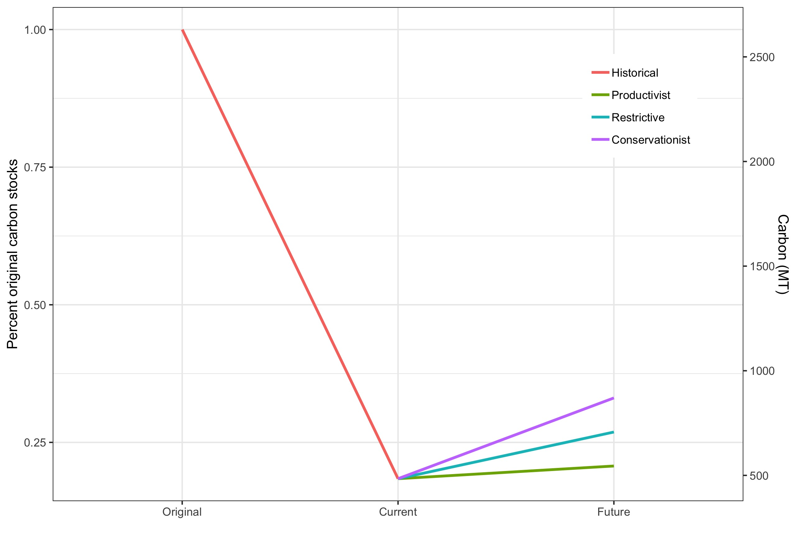

<style>
#main-img-left {
 width: 23%;
 margin-bottom: 1.5%;
}
#main-img-center {
 width: 10%;
 margin-bottom: -0.5%;
}
#main-img-right {
 width: 7%;
}
p.caption {
 margin-top: 0;
 margin-bottom: 0;
}
</style>


```{r, include=FALSE}
knitr::opts_chunk$set(echo = FALSE,
                      warning = FALSE,
                      tidy = FALSE,
                      message = FALSE,
                      fig.align = 'center',
                      out.width = "100%")
options(knitr.table.format = "html") 
```
# Introduction
Cattle ranching is historically and geographically the most extended land use in Colombia with up to 35 million hectares dedicated to this activity [@etter_historical_2008]. As such, it is considered one of the main drivers of biodiversity loss and the largest source of CO~2~ emissions in the country[@ideam_inventario_2016]. Thus, how these areas are managed may have a large impact on avoiding biodiversity loss and climate change mitigation. Considering that the cattle ranching sector is highly commited to lead a transition towards sustainable use models and stop deforestation, this research aims to evaluate the impact of implementing three management scenarios on species diversity, species protection and carbon stocks, providing a roadmap for future conservation action in cattle ranching landscapes.

# Methods
**Land cover data and scenarios.-** In this research, original[@etter_historical_2008], current[@ideam_ecosistemas_2007] and future[@zuluaga_areas_2018] land covers under three management scenarios were considered (Figure \@ref(fig:figure1)). In each time slice, land cover was divided into forested and open ecosystems (pastures, croplands, savannas, grasslands and shrublands).\

In each scenario, cattle ranching areas were classified into three alternative management categories [@zuluaga_areas_2018], based on their biophysical attributes and productive profile: suitable, suitable with restrictions and unsuitable. For suitable areas, we assumed current land cover would not change from current conditions. In suitable with restrictions areas, we assummed 50% of the original forest would be restored to its original state and the remaining area would continue being used for cattle ranching. Finally, in unsuitable areas, we assummed that if land was suitable for another agricultural use according to UPRA (https://www.upra.gov.co/), it would continue being an open ecosystem, otherwise its original land cover would be fully restored. 

**Biodiversity analysis.-** we used IUCN range maps and habitat use information[@iucn_2018_iucn_2018] for 1,244 bird species that occur in continental Colombia. We produced species maps based on each species affinity for forested or open habitats and existing land covers for all 5 time slices considered. Then, we stacked the maps for each time slice to produce species richness estimations. We compared species richness through time only for areas were pastures were artificial (hereafter cattle ranching areas), thus natural pastures (e.g. east plains) were excluded from analyses.

```{r figure1, out.width='100%', fig.cap='Left, current ecosystem transformation for cattle ranching. Right, conservationist management scenario.'}
library(cowplot)
library(ggplot2)
p1 <- ggdraw() + draw_image('Figures/Original_ecosystems2.jpg', scale = 1.2)
p2 <- ggdraw() + draw_image('Figures/scenario3.jpg', scale = 1.2)
plot_grid(p1, p2)
```

**Gap analysis.-** To evaluate the gain from managing cattle ranching landscapes at the species level, we compared the existing representation of species in the protected area system, in current cattle ranching areas (assuming no further deforestation) and under the implementation of management scenarios. Representation targets were set at 100% if species current ranges were < 1,000 km^2^ and 10% when current range > 250,000 km^2^. For intermediate ranges, representation targets were derived using a logarithmic interpolation[@rodrigues_global_2004]. 

**Carbon stock analysis.-** We estimated the potential carbon stocks in cattle ranching areas for each time slice by using the emission factors available for each Holdridge' forest type[@ideam_mapa_2011] and for pastures for each natural region of Colombia (Navarrete et al., *unpublished data*).

# Results and Discussion
```{r figure2, out.width='100%', fig.cap='Left, current average species richness. Right, trends in average species richness.'}
library(cowplot)
library(ggplot2)
p1 <- ggdraw() + draw_image('Figures/Birds_current.jpg', scale = 1)
p2 <- ggdraw() + draw_image('Figures/scenario_comparison_2ax_birds.jpg', scale = 1)
plot_grid(p1, p2)
```
Bird richness in cattle ranching areas has decreased on a 31.7% on average as a consequence of historical land transformation (Figure \@ref(fig:figure2)). Under management scenarios, richness could increase between 1.4 - 8.8% from current status. This uptake in richness could be further improved by implementing sustainable cattle ranching practices, such as sylvopastoral systems, live fences and trees in pastures, which have been shown to increase bird richness as much as 29%. **Caveat:** we assumed that IUCN maps represent the historical extent of species ranges. In reality, they may omit areas were once suitable, particularly in the Caribbean, Cauca and Magdallena valley regions.

Only 5 threatened species and 371 in total met their representation target in the existing protected area system. Avoiding deforestation by itself, could help achieving representation targets for 297 more species, including 7 threatened species. Implementation of restrictive and conservationist management scenarios, would drive species representation up to 191% and threatened species representation by 300% (Table \@ref(tab:table1)). 

```{r table1}
gap.analysis<-openxlsx::read.xlsx("species_analysis.xlsx",2)
knitr::kable(
  gap.analysis[,c(-2,-6)], format = "html",
  caption = "Species representation in protected and cattle ranching areas under management scenarios",
  align = "c", col.names = c("Status",
                             "Protected<br>areas",
                             "Cattle<br>areas",
                             "Productive<br>scenario",
                             "Rest./Cons.<br>scenario"),
  escape = FALSE)
```


Carbon stocks in cattle ranching areas have decreased on average by 81.6% from deforestation. Management of these areas could increase carbon stocks by 12.5-79.7% from current status (Figure \@ref(fig:figure3)). 

```{r figure3, out.width= '90%', fig.cap='Estimated trend in carbon stocks'}

```

# References
